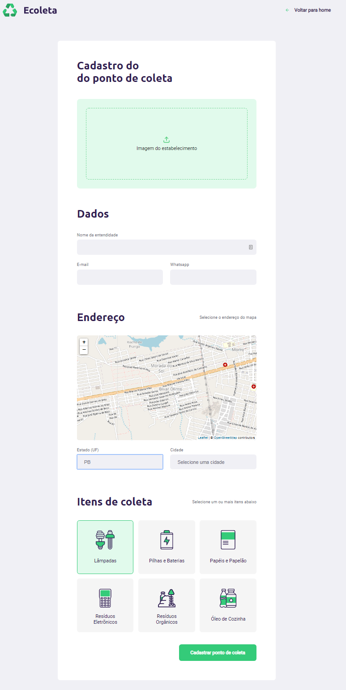

<h1 align="center">
    
</h1>

## 🚀 Next Level Week 🚀

O NLW é uma semana prática com muito código, desafios, redes e um único objetivo: levá-lo ao próximo nível. Esta semana é ministrada pela Rocketseat.

### Sobre 📜

O projeto tem como finalidade estabelecer uma conexão entre empresas e/ou entidades que coletam resíduos (orgânicos e inorgânicos) às pessoas e/ou entidades que necessitam constantemente descartar esses resíduos. Solucionando um grande problema recorrente que é o descarte inadequado do lixo, facilitando o processo de recliclagem e reutilização.

### Tela Web/FrontEnd // Mobile. ⌨📺📱

<h1 align="center">
    
</h1>

<h1 align="center">
    
</h1>

<h1 align="center">
    
</h1>

###  Requerimentos / Dependências 📌

Para instalar as dependências execute no terminal  

Se for usar o Yarn:  
`yarn install`

Se for usar o NPM:  
`npm install`

### Tecnologias 💻 

- [TypeScript](https://www.typescriptlang.org)
- [Node.js](https://nodejs.org/en/)
- [React](https://reactjs.org)
- [React Native](https://facebook.github.io/react-native/)
- [Expo](https://expo.io/)
- [Expo Mail Composer](https://docs.expo.io/versions/latest/sdk/mail-composer/)
- [Express](https://expressjs.com/pt-br/)
- [Celebrate](https://www.npmjs.com/package/celebrate)
- [Knex](http://knexjs.org/)
- [SQLite3](https://www.sqlite.org/version3.html)
- [React Icons](https://www.npmjs.com/package/react-icons)
- [Axios](https://www.npmjs.com/package/axios)
- [React-dom](https://pt-br.reactjs.org/docs/react-dom.html)
- [React-router-dom](https://www.npmjs.com/package/react-router-dom)

### Contato 📫

Contato: - yarlley.silva@gmail.com
 
LinkedIn - https://www.linkedin.com/in/yarlleysilva/